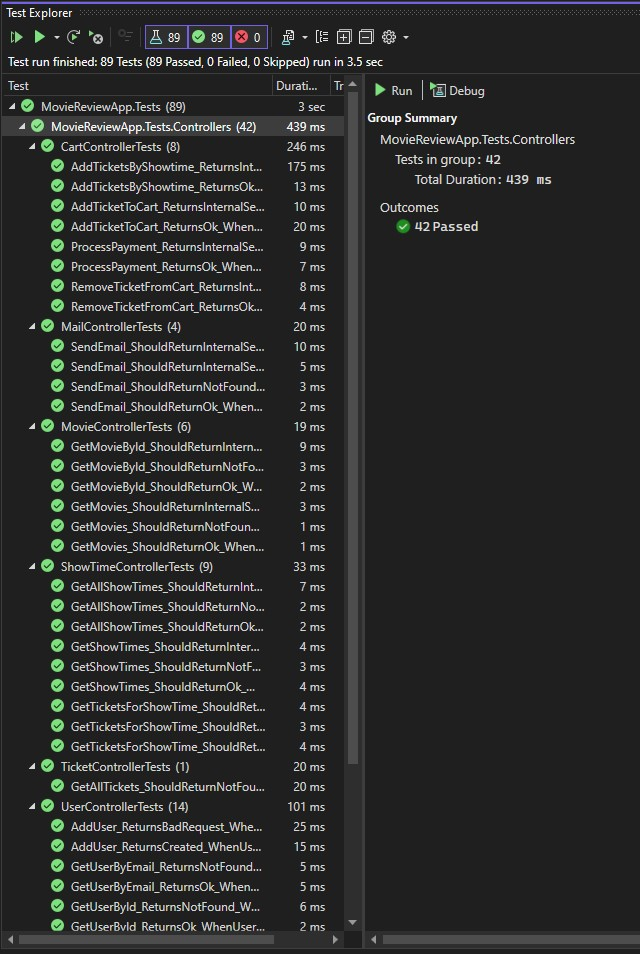
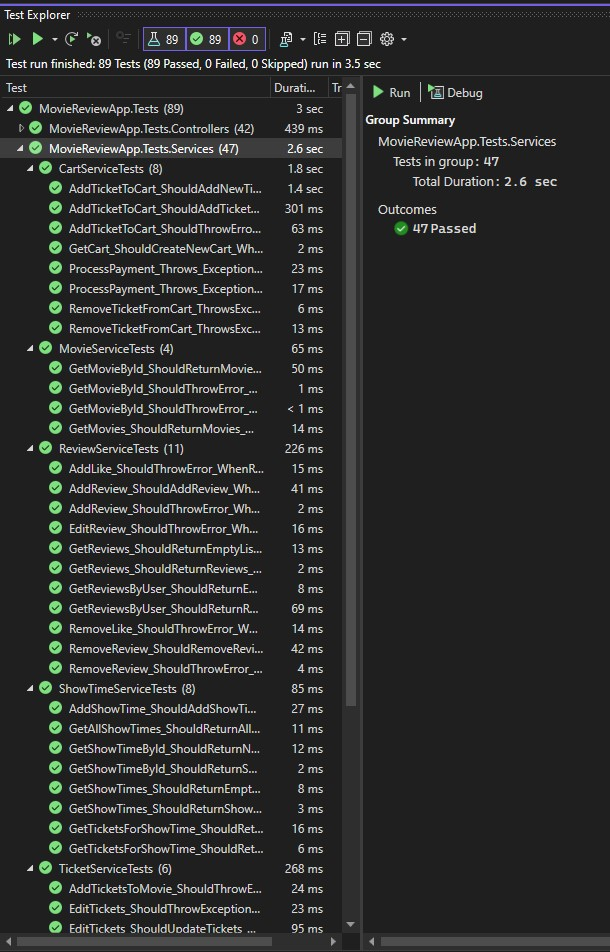

<a id="readme-top"></a>
<br />
<div align="center">
<h3 align="center">Movie-Review-App CSCE 547</h3>

  <p align="center">
    design and implement a .NET API for a basic movie review experience application
    <br />
    <br />
  </p>
</div>

## Team

* Georgia Towne - Scrum Analyst
*	Adams Keefer – Technical Design Analyst
*	Andy Davison – Test Analyst
*	Cole Reiss – Developer Analyst
*	Mark Johnson – Developer Analyst
*	Sambit Mukherjee – Developer Analyst

<p align="right">(<a href="#readme-top">back to top</a>)</p>

## About The Project

![Movie Screen Shot][product-screenshot]

Our web application is a cutting edge platform designed to streamline the movie-going experience by taking the ability to purchase tickets, and combining that with the social aspect of leaving movie reviews. The convenience and interactivity of this application cater to the needs of both casual moviegoers and film enthusiasts.

Our application consists of 4 main interactive experiences. Users can 1) browse and create movie reviews, 2) purchase movie tickets, 3) edit their user preferences to best fit their needs, and 4) admins can manage movie, ticket, and showtime inventory.

Please view the next few screenshots to get an idea of what this application looks like.

### Review Screen (User View)
![Review Screen Shot][review-screenshot]

### Cart Screen
![Cart Screen Shot][cart-screenshot]

### Admin Management Screen
 ![Admin Screen Shot][admin-screenshot]
 
<p align="right">(<a href="#readme-top">back to top</a>)</p>

### Built With

* Frontend - React + Vite
* Backend - C# (Dotnet)
* Database Management - Entity Core Framework & SQL Server

<p align="right">(<a href="#readme-top">back to top</a>)</p>


<!-- GETTING STARTED -->
## Getting Started

How to setup this project locally:

### Prerequisites

Please have these installed on your computer to run our project. You will also want an instance of SQL Server.
* npm
  ```sh
  npm install npm@latest -g
  ```
* dotnet
  ```sh
  https://dotnet.microsoft.com/en-us/download/dotnet
  ```
* Entity Framework Core
  ```sh
  dotnet add package Microsoft.EntityFrameworkCore.SqlServer
  ```

### Installation

1. Clone the repo
   ```sh
   git clone https://github.com/Sambit096/Movie-Review-App.git
   ```
2. Setup Backend - Navigate to backend folder
3. Update Database (edit appsettings.json file if needed)
   ```sh
   dotnet ef database update
   ```
4. Run Backend
   ```sh
   dotnet run
   ```
5. Setup Frontend - Navigate to frontend/Movie-ReviewFE folder
6. Install npm Packages
   ```sh
   npm install
   ```
7. Run Frontend
   ```sh
   npm run dev
   ```

<p align="right">(<a href="#readme-top">back to top</a>)</p>


## Technical Documents and Screenshots

* [Link to Business Requirements Document][link-business]
* [Link to Weekly Updates][link-weekly]
* [Backlog Link (Private)][link-project] - Tracked via Weekly Updates Document and Github Project

![Entity Screen Shot][entity-screenshot]

<p align="right">(<a href="#readme-top">back to top</a>)</p>


## Testing Instructions

Enter Testing Instructions here
Steps to run Backend Unit Tests:
1. Open VSCode and open a terminal
2. cd into the projects Testing directory (\Movie-Review-App\Movie-Review-App.Tests)
```sh
cd .\Movie-Review-App.Tests
```
3. Run the Testing Project:
```sh
dotnet test .\MovieReviewApp.Tests.csproj
```
4. View console for output to see passing/failing tests

 

<p align="right">(<a href="#readme-top">back to top</a>)</p>


## AI/Copilot Use

AI and Copilot were used minimally throughout this project. We used AI to help us create sample data for our database (can be found in the dbContext file) as well as debugging and designing our frontend.

<p align="right">(<a href="#readme-top">back to top</a>)</p>


[product-screenshot]: ReadmeInfo/project.png
[entity-screenshot]: ReadmeInfo/entities.png
[admin-screenshot]: ReadmeInfo/admin.png
[cart-screenshot]: ReadmeInfo/cart.png
[review-screenshot]: ReadmeInfo/reviews.png
[link-project]: https://github.com/users/Sambit096/projects/4]
[link-business]: https://docs.google.com/document/d/1SQUSj7MYeESE2oluxp6o_LA63nJzexJ2unEtSn-zBtM/edit?usp=sharing
[link-weekly]: https://emailsc-my.sharepoint.com/:w:/g/personal/gtowne_email_sc_edu/EQ2EE0_qcTRLsuc1F3g_rY8BtWFXlseZhtPhAvDRopV9UA?e=ho6wNJ
